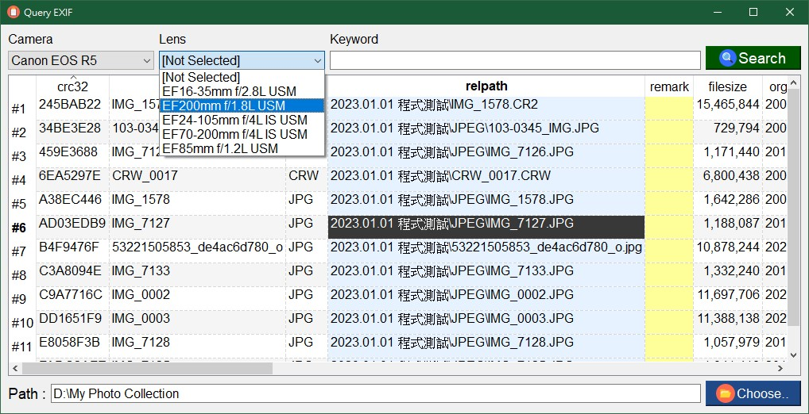

# EXIF & CRC32 Reader

A tool to read EXIF & CRC32 information into database and query. 

## How to install

 Base on `Python 3.9+`, `PyQt5`, and `exiftool`.

### For windows / macOS users
- Download python 3.9+ from [Python official website](https://www.python.org/downloads/) and install.
- Install `PyQt5` via pip command.
```
pip install pyqt5
```
- Install `pyexiftool` via pip command.
```
pip install pyexiftool
```
- Download & install [exiftool](https://exiftool.org/index.html) .

**Windows user**
- Rename `exiftool(-k).exe` to `exiftool.exe` and place it anywhere in PATH.

**macOS user**:
- Download package named `ExifTool-xx.xx.dmg` and install it.

### For linux base users
- Install pip3.
```
sudo apt install python3-pip
```

- Install `PyQt5` via `pip` or `apt` command:
  - pip3:
  ```
  sudo pip3 install pyqt5
  ```
  - apt:
  ```
  sudo apt install python3-pyqt5
  ```
- Install `pyexiftool` via pip command.
```
sudo pip3 install pyexiftool
```

- Install `exiftool`.
```
sudo apt exiftool
```

## Launch application
**Windows user**
```
python main.py
```
**macOS / linux user**
```
python3 main.py
```

## How to use?

- Main screen


- Click `Generate EXIF Info` button to read / generate information into database.
- Click `Query EXIF Info` button to query EXIF infomation from database.


1. Choose your photo directory.
2. Select file extension with clicked check box.
3. Click `Write to DB` button to start read crc32 & EXIF and write information into database. After process started, this button will become `Cancel` button.
4. (*Optional*) Force stop reading process by click `Cancel` button.


- Use keyword to search / query EXIF.
- Two data filters : camera & lens.
- Right-click on field `relpath` to preview picture.


## Author

[benjenq](https://github.com/benjenq)
